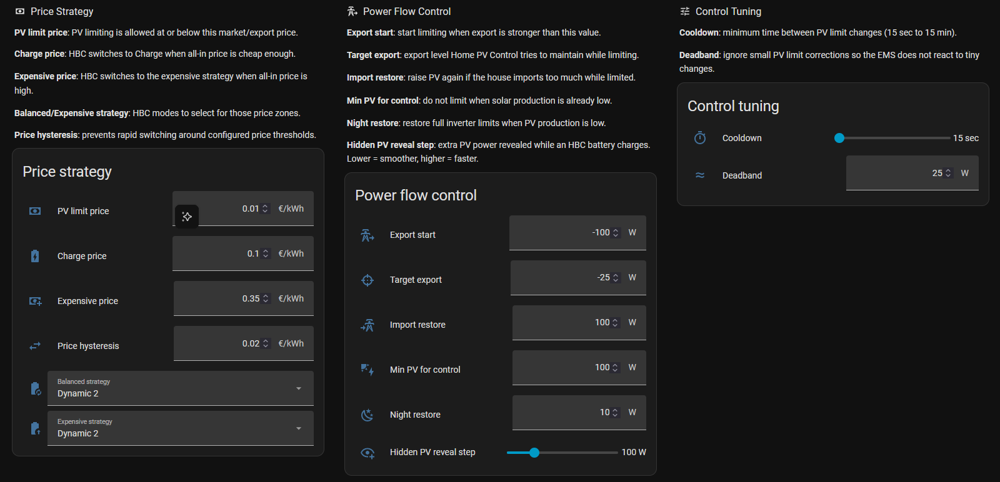
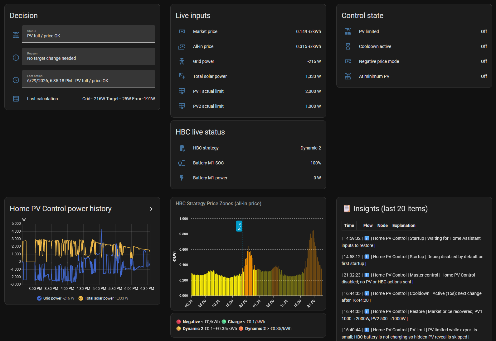

<p align="center">
  
</p>

<p align="center">
  <a href="releases/v1.0.3/release.md"></a>
  
  
  
  
</p>

## Requirements

- Home Assistant
- Node-RED
- PV inverter(s) with writable power limit entities
- HBC is optional and only required for battery strategy control

⚠️ Home PV Control is designed for PV inverters that support external power limit control (curtailment). PV curtailment features require at least one writable inverter power limit entity.


## Home PV Control (HPVC)

**Home PV Control** is a standalone photovoltaic export-control add-on for Home Assistant and Node-RED. It works independently or together with **Home Battery Control (HBC)**.

- 🌐 Documentation for HBC: https://docs.homebatterycontrol.com/

Home PV Control manages PV inverter power limits while HBC remains responsible for battery charging, discharging and strategy selection.

> Home PV Control does **not** modify Home Battery Control files. It runs next to HBC.

## What it does

Home PV Control dynamically controls writable PV inverter limit entities.

It is designed for:

- dynamic energy prices
- negative price hours
- avoiding export when export is not wanted
- keeping useful PV for house load
- smoothly increasing PV again when the house starts importing
- systems with one inverter or many inverters

## Features

| Feature | Status |
|---|---:|
| Standalone Node-RED flow | ✅ |
| Home Assistant package helpers | ✅ |
| HBC-style dashboard | ✅ |
| Multi-inverter support | ✅ |
| Per-inverter minimum power | ✅ |
| Proportional PV target split | ✅ |
| Dynamic PV limiting | ✅ |
| Dynamic PV increase on import | ✅ |
| Night restore to full PV | ✅ |
| Optional HBC strategy handoff | ✅ |
| HBC files remain untouched | ✅ |

## Architecture

```text
                 ┌───────────────────────┐
                 │  Home Battery Control │
                 │  Battery strategies   │
                 └───────────┬───────────┘
                             │
                             ▼
                    Marstek / battery

Market/full price ─────┐
Grid power sensor ─────┼──► Home PV Control Node-RED flow ───► PV inverter limits
PV power sensor ───────┘
```

Home PV Control may optionally select the HBC strategy, but HBC still performs the battery control.

## Quick install

1. Copy `home assistant/pv_ems_config.yaml` to:

   ```text
   /config/packages/pv_ems_config.yaml
   ```

2. Quick Reload or Restart Home Assistant.

3. Import `node-red/pv_ems_flow.json` into Node-RED and deploy.

4. Add/import `home assistant/pv_ems_dashboard.yaml` as a separate dashboard.

5. Configure core entities:
   - grid power sensor
   - market/export price sensor
   - all-in import price sensor
   - PV total power sensor
   - inverter limits

6. Enable Home PV Control.

See [Installation](docs/01-installation.md).

The EMS calculates total target PV power and splits it proportionally by `full_power`.

Each inverter is clamped to its own `minimum_power`.

## Default recommended values

| Setting | Recommended |
|---|---:|
| PV Limiting Price | `0.00 €/kWh` |
| Start Limiting Export | `-200 W` |
| Target Export | `-25 W` |
| Import Recalculation | `200 W` |
| Minimum PV Power | `100 W` |
| Night Restore | `10 W` |
| Minimum PV Change | `1 min` |
| Deadband | `25 W` |

## Trigger design

Home PV Control evaluates on:

- Every 15 seconds: PV limit, restore, negative-price mode and HBC strategy.
- On deploy/startup: one immediate evaluation.
- When Home PV Control settings change: one immediate evaluation.

The package does not use hardcoded grid/PV sensor triggers, so it stays generic for every installation.

## Documentation

- [Installation](docs/01-installation.md)
- [Configuration](docs/02-configuration.md)
- [How it works](docs/03-how-it-works.md)
- [Troubleshooting](docs/04-troubleshooting.md)
- [Wiki index](docs/wiki/Home.md)
- [Changelog](CHANGELOG.md)

## Repository structure

```text
home assistant/
  pv_ems_config.yaml      # Home Assistant helpers/package
  pv_ems_dashboard.yaml   # Separate HBC-style dashboard

node-red/
  pv_ems_flow.json        # Node-RED flow

docs/
  01-installation.md
  02-configuration.md
  03-how-it-works.md
  04-troubleshooting.md
  wiki/
```

## Screenshots

### Main Dashboard




### Debug & Insights


### Node-RED Flow


## HACS note

This repository is structured to be easy to use with Home Assistant and Node-RED.  
It is **not a normal Python Home Assistant integration**. HACS support would require using this as a custom repository for documentation/files, not as a standard integration install.

See [HACS notes](docs/wiki/HACS.md).

## Roadmap

- More dashboard examples
- Node-RED trace/debug dashboard
- Optional helper-based trigger configuration
- Import/export examples for popular inverter brands
- More safety checks around invalid inverter JSON

## Credits

Inspired by the Home Assistant + Node-RED workflow of Home Battery Control.

Home Battery Control: https://github.com/gitcodebob/marstek-venus-rs485-node-red

## License

GPL-3.0-or-later. See [LICENSE](LICENSE).

## Disclaimer

Home PV Control modifies PV inverter power limits through Home Assistant and Node-RED integrations.

By using this software, you acknowledge that:

* You are responsible for verifying that your inverter, Home Assistant, and Node-RED configuration are compatible and correctly configured.
* Incorrect configuration may result in reduced solar production, unexpected inverter behavior, or failure to achieve the intended energy-management strategy.
* The software is provided "as is" without any warranty of any kind.
* Always test changes in a safe environment before using them in a production energy system.
* The author is not responsible for any financial losses, equipment damage, data loss, regulatory issues, or other consequences resulting from the use of this project.

Use this project at your own risk.

