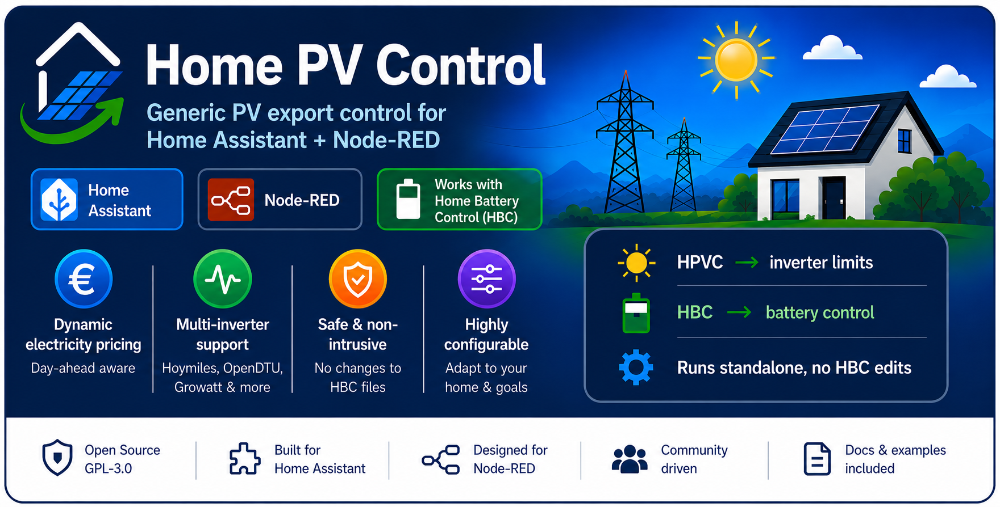
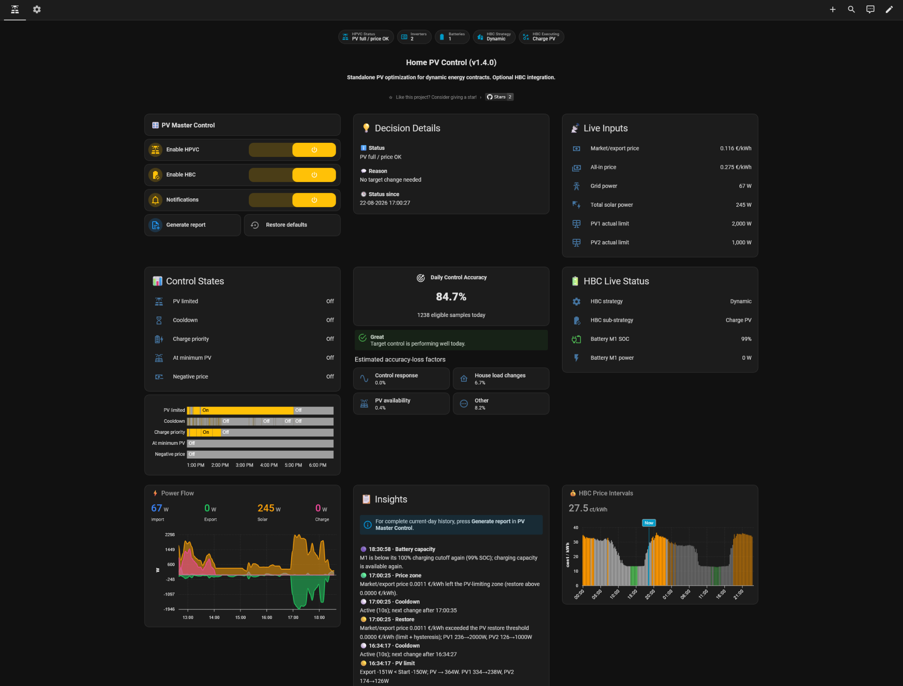
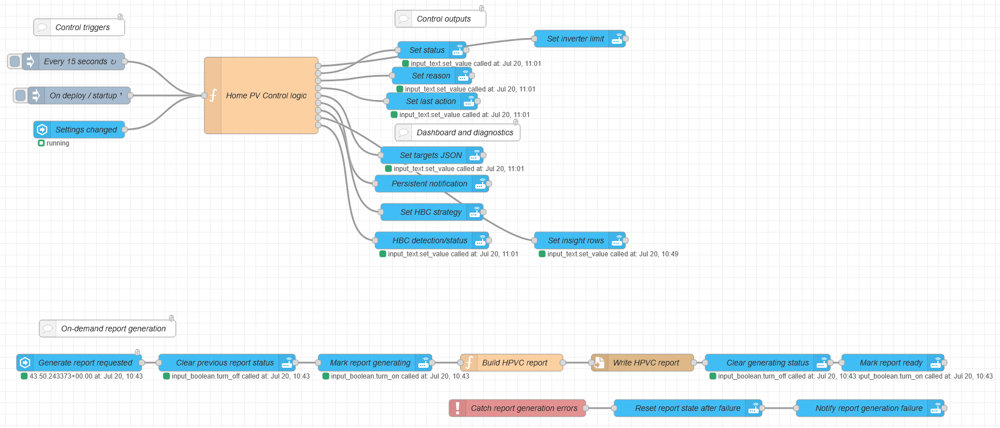

<p align="center">
  
</p>

<p align="center">
  <a href="RELEASE_NOTES.md"></a>
  <a href="https://www.home-assistant.io/"></a>
  <a href="https://nodered.org/"></a>
  <a href="https://github.com/gitcodebob/marstek-venus-rs485-node-red"></a>
  <a href="LICENSE"></a>
  <a href="https://github.com/BioPC/home-pv-control/stargazers"></a>
</p>

# Home PV Control

**Home PV Control (HPVC)** is a standalone Home Assistant and Node-RED solution for dynamically controlling writable PV inverter power limits.

It can reduce unwanted export, respond to low or negative market prices, restore PV when the home starts importing, and optionally coordinate strategy selection with [Home Battery Control](https://github.com/gitcodebob/marstek-venus-rs485-node-red).

> HPVC controls PV inverter limits. HBC remains responsible for battery charging and discharging, and HPVC does not modify HBC files.

## Key features

- Dynamic PV limiting and import restore
- Low and negative market-price handling
- One or multiple writable PV inverter limits
- Proportional target allocation with per-inverter minimums
- Automatic full-limit restore after sunset, with PV-threshold fallback
- Optional HBC strategy coordination
- Adaptive Hidden PV Reveal for one or multiple charging batteries
- Dashboard, Insights, accuracy metrics and support-report export



## Requirements

- Home Assistant
- Node-RED
- At least one PV inverter with a writable power-limit entity
- Grid-power, market-price, all-in price and total PV-power sensors
- Home Battery Control only when optional HBC coordination is used

> PV curtailment requires an inverter integration that supports external writable power limits. Entity behaviour and supported limit ranges differ between inverter integrations.

## Quick installation

1. Copy `home assistant/hpvc_config.yaml` to:

   ```text
   /config/packages/hpvc_config.yaml
   ```

2. Reload the relevant Home Assistant configuration where supported, or restart Home Assistant.
3. Import `node-red/hpvc_flow.json` into Node-RED and deploy it.
4. Add `home assistant/hpvc_dashboard.yaml` as a separate Home Assistant dashboard.
5. Configure the grid, price, PV-power and inverter-limit entities.
6. Verify the configuration and enable Home PV Control.

See the full [installation guide](docs/01-installation.md).

> HPVC is not a standard Home Assistant custom integration. HACS may track or download the repository as a custom repository, but installation still requires the YAML package, dashboard and Node-RED flow steps above.

## Recommended defaults

| Setting | Default |
|---|---:|
| PV limit price | `0.02 €/kWh` |
| Charge price | `0.10 €/kWh` |
| Expensive price | `0.35 €/kWh` |
| Shared price hysteresis | `0.02 €/kWh` |
| Export start | `-150 W` |
| Target export | `-25 W` |
| Import restore | `150 W` |
| Minimum PV for control | `100 W` |
| Night restore fallback | `10 W` |
| Cooldown | `60 s` |
| Deadband | `25 W` |

First-install initialization and **Restore defaults** apply the same recommended values.

## How it works

```text
Market and all-in prices ─┐
Grid power sensor ────────┼──► Home PV Control ───► Writable PV limits
Total PV power ───────────┘             │
                                        └──► Optional HBC strategy selection
```

HPVC calculates a total target PV output and distributes it proportionally across configured inverters. Each target remains within that inverter's configured minimum and full-power limits.

Hidden PV Reveal can temporarily raise limits while batteries are charging to discover PV production hidden by curtailment. Its allowance adapts to battery headroom, state of charge and available grid-export margin.

For the complete runtime sequence, safeguards and reveal behaviour, see [How it works](docs/03-how-it-works.md).

## Screenshots

### Settings

Configuration, validation, inverter setup and optional HBC controls.


### Support report

Generate and view a diagnostic report for troubleshooting and issue reports.


### Node-RED flow



## Documentation

- [Installation](docs/01-installation.md)
- [Settings and configuration](docs/02-configuration.md)
- [How it works](docs/03-how-it-works.md)
- [Troubleshooting](docs/04-troubleshooting.md)
- [Entity inventory](ENTITY_INVENTORY.md)
- [Release notes](RELEASE_NOTES.md)
- [Changelog](CHANGELOG.md)

When reporting a problem, include the exported HPVC support report, Home Assistant version, Node-RED version and inverter integration.

## Repository structure

```text
home assistant/
  hpvc_config.yaml
  hpvc_dashboard.yaml

node-red/
  hpvc_flow.json

docs/
  01-installation.md
  02-configuration.md
  03-how-it-works.md
  04-troubleshooting.md

examples/
assets/
CHANGELOG.md
RELEASE_NOTES.md
ENTITY_INVENTORY.md
```

## Support the project

<p>
  <a href="https://ko-fi.com/markoceri"></a>
  <a href="https://paypal.me/markoceri"></a>
</p>

## Credits

Inspired by the Home Assistant and Node-RED workflow of [Home Battery Control](https://github.com/gitcodebob/marstek-venus-rs485-node-red).

## License

Licensed under GPL-3.0-or-later. See [LICENSE](LICENSE).

## Disclaimer

HPVC changes PV inverter power limits. Verify all entities, limits and inverter behaviour before unattended use. Incorrect configuration may reduce generation or cause unexpected control behaviour. This project is provided without warranty; use it at your own risk.
