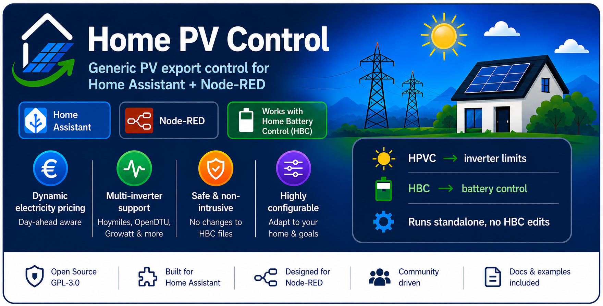
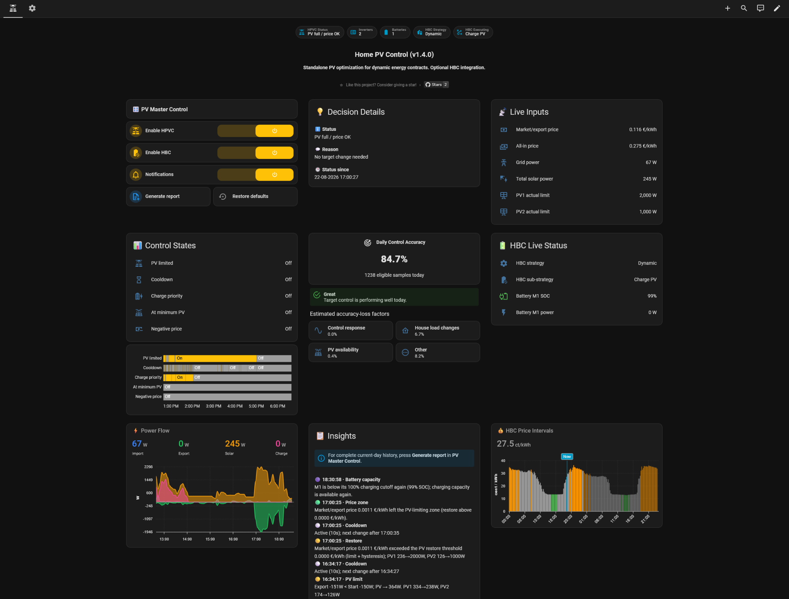
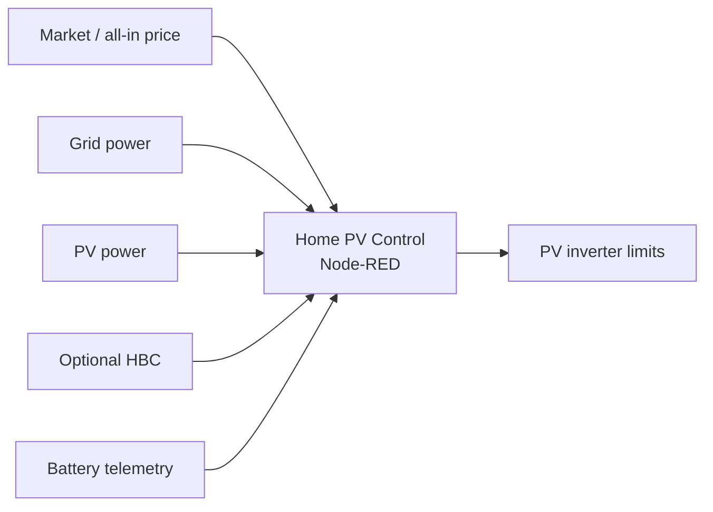
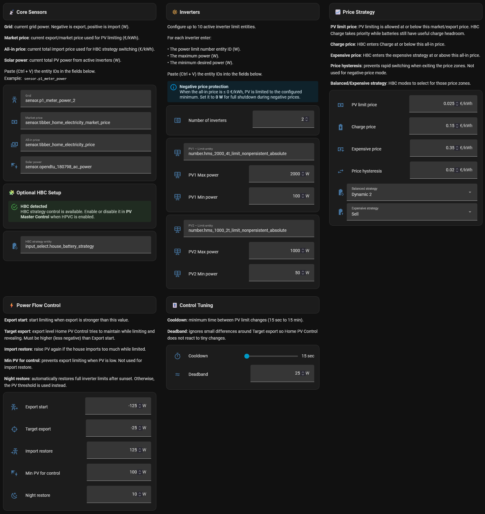
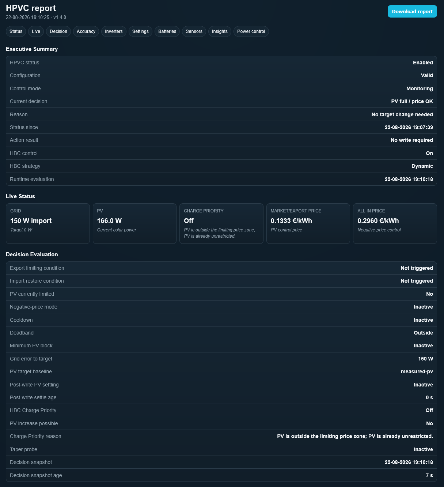
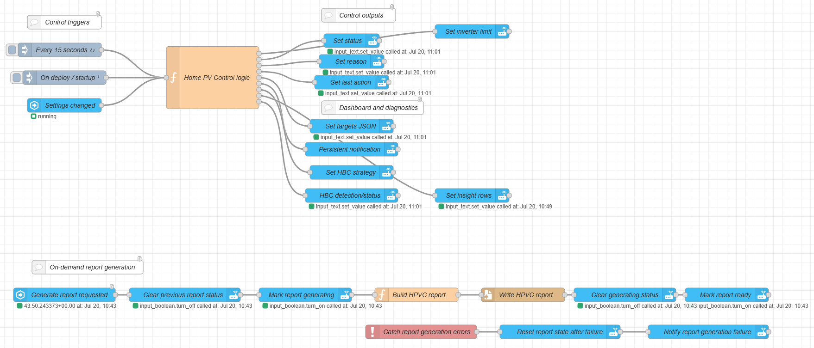

<p align="center">
  
</p>

<p align="center">
  <a href="releases/v1.5.4/release.md"></a>
  <a href="https://www.home-assistant.io/"></a>
  <a href="https://nodered.org/"></a>
  <a href="LICENSE"></a>
  <a href="https://github.com/BioPC/home-pv-control/stargazers"></a>
</p>

<p align="center">
  <a href="https://ko-fi.com/mperez"></a>
  <a href="https://paypal.me/MPerezCabrera"></a>
</p>

# Home PV Control

Home PV Control (HPVC) dynamically controls, limits and restores PV inverter output in Home Assistant through Node-RED. It is designed for dynamic electricity contracts and can run as a standalone PV controller or integrate with Home Battery Control (HBC).

- Reduce unwanted or uneconomic PV export.
- Preserve useful PV for household consumption.
- Restore inverter output automatically when conditions improve.
- Coordinate available PV with optional HBC battery charging.
- Protect against negative all-in prices with minimum-PV control and optional HBC grid charging.

> [!IMPORTANT]
> HPVC requires at least one configured inverter control path: either a writable Home Assistant `number` entity or a stable Home Assistant action/service adapter. Limits can use Watts or Percent. HPVC controls through Home Assistant integrations; it does not communicate with inverter hardware directly.

See [Inverter compatibility](docs/05-inverter-compatibility.md) and [Configuration](docs/02-configuration.md) for the four compatibility statuses, current brand/integration matrix and configuration.

<p align="center">
  
</p>

## Contents

- [Quick install](#quick-install)
- [Requirements](#requirements)
- [Main features](#main-features)
- [How HPVC works](#how-hpvc-works)
- [Dashboard](#dashboard)
- [Shipped defaults](#shipped-defaults)
- [Home Battery Control integration](#home-battery-control-integration)
- [Safety](#safety)
- [Accuracy, Insights and reports](#accuracy-insights-and-reports)
- [Architecture](#architecture)
- [Upgrading](#upgrading)
- [Documentation](#documentation)
- [Uninstalling](#uninstalling)
- [Support](#support)
- [Repository structure](#repository-structure)
- [Support the project](#support-the-project)
- [Credits](#credits)
- [License](#license)
- [Disclaimer](#disclaimer)

## Quick install

1. **Enable Home Assistant packages and install the HPVC package file.**

   Open `configuration.yaml` and make sure package loading is enabled:

   ```yaml
   homeassistant:
     packages: !include_dir_named packages
   ```

   If your `configuration.yaml` already contains a `homeassistant:` section, add the `packages:` line under that existing section instead of creating a second `homeassistant:` key.

   Copy [`home assistant/hpvc_config.yaml`](home%20assistant/hpvc_config.yaml) to:

   ```text
   /config/packages/hpvc_config.yaml
   ```

2. **Install and register the HPVC dashboard.**

   Recommended — managed dashboard with automatic Smart Update support:

   Copy [`home assistant/hpvc_dashboard.yaml`](home%20assistant/hpvc_dashboard.yaml) to the Home Assistant configuration root, in the same folder as `configuration.yaml`:

   ```text
   /config/hpvc_dashboard.yaml
   ```

   Register it in `configuration.yaml`:

   ```yaml
   lovelace:
     mode: storage
     dashboards:
       hpvc-dashboard:
         mode: yaml
         title: Home PV Control
         icon: mdi:solar-power
         show_in_sidebar: true
         filename: hpvc_dashboard.yaml
   ```

   If a `lovelace:` section already exists, merge the `hpvc-dashboard:` entry into the existing `dashboards:` section instead of adding a second `lovelace:` key.

   Alternative — custom dashboard:

   Create a dashboard/view in Home Assistant and paste the supplied dashboard YAML manually. This works, but Smart Update will not modify that custom dashboard.

3. **Check the Home Assistant configuration and restart Home Assistant once.**

   Do this only after the package file and dashboard registration are both in place.

4. **Import and deploy the Node-RED flow.**

   Import [`node-red/hpvc_flow.json`](node-red/hpvc_flow.json) into Node-RED and deploy it.

5. **Configure HPVC.**

   Open the always-visible **Settings** tab and configure the grid-power, market/export-price, all-in-price, PV-power and per-inverter control paths.

6. **Verify first startup.**

   Wait for first-install validation to complete. HPVC enables automatically once all required live inputs and control settings are valid.

See the full [installation guide](docs/01-installation.md) for dependencies and first-run verification.

## Requirements

- Home Assistant Core **2025.12 or newer** with package support. Earlier versions may work but are outside the documented support baseline.
- A currently supported Node-RED runtime. Node-RED 4.x requires Node.js 18.2.0 or newer for the declared Home Assistant websocket 0.80.3 baseline; Node-RED 5.x requires Node.js 22 or newer. Home Assistant add-on users should use the runtime bundled by the supported Node-RED add-on rather than pinning a separate JavaScript-runtime minimum.
- One or more PV inverters with either a writable `number.*` active-power limit or a stable Home Assistant action/service that can apply an active-power limit.
- A valid grid-power sensor, market/export-price sensor, all-in-price sensor and PV-power sensor.
- ApexCharts Card for the supplied dashboard graphs.
- Home Battery Control only for optional HBC execution tracking and Charge Priority.

## Main features

| Feature | Status |
|---|---:|
| Standalone PV export control | ✅ |
| Dynamic export limiting and import recovery | ✅ |
| Multi-inverter support with per-inverter minimum/maximum limits | ✅ |
| Per-inverter Watt or percentage limits | ✅ |
| Generic per-inverter Number entity / Action/service adapters | ✅ |
| Negative all-in-price minimum-PV protection | ✅ |
| Optional HBC grid charging during negative prices | ✅ |
| Optional HBC Charge Priority for `Charge` / `Charge PV` | ✅ |
| HBC multi-battery support (1–6 batteries) | ✅ |
| Night Restore with PV recovery hysteresis | ✅ |
| Today’s Insights and Power Control history | ✅ |
| Daily Control Accuracy with four loss factors | ✅ |
| On-demand HTML and TXT support reports | ✅ |
| Ready-to-import Home Assistant dashboard | ✅ |

## How HPVC works

HPVC evaluates:

- every **10 seconds**;
- immediately after deploy/startup;
- when relevant HPVC settings change.

Normal control follows a simple priority order:

1. Validate required inputs and configured inverter limits.
2. Apply negative-price protection when the all-in price is `<= 0`.
3. Handle Night Restore when PV production has effectively ended.
4. Coordinate available PV with HBC Charge Priority when HBC is enabled and eligible.
5. Limit export when price and grid conditions require it.
6. Restore PV when import or price recovery makes more output appropriate.
7. Respect cooldown and deadband so unnecessary writes are avoided.

## Dashboard

The supplied dashboard provides three main working areas:

- **Main** — current HPVC status, power flow, price context and control state.
- **Settings** — sensor selection, inverter control paths, thresholds, HBC permissions and restore options.
- **Report** — on-demand HTML/TXT diagnostics for installation checks, troubleshooting and support.

See [Installation](docs/01-installation.md) and [Configuration](docs/02-configuration.md) for setup details.

## Shipped defaults

These are starting points, not universal recommendations. Review them for your inverter, sensor definitions, electricity contract and local rules.

| Setting | Shipped default |
|---|---:|
| HBC integration / Charge Priority | Off |
| Force charge at negative price | On by default; effective only while HBC control is enabled |
| PV limiting price | `0.00 €/kWh` |
| Price hysteresis | `0.02 €/kWh` |
| Export start | `-150 W` |
| Target export | `0 W` |
| Import restore | `150 W` |
| Min PV for control | `100 W` |
| Night restore PV threshold | `10 W` |
| Cooldown | `30 s` |
| Deadband | `25 W` |

> **PV limiting price guidance:** use €0.00/kWh with a net export-price sensor. For a raw market-price sensor, account for fees, compensation and local rules.

See [Configuration](docs/02-configuration.md#marketexport-price-sensor) for sensor guidance and examples.

## Home Battery Control integration

HPVC can integrate with Home Battery Control (HBC) while keeping HBC optional.

- **Enable HBC** is the master permission for HPVC to control HBC strategy changes.
- **Force charge at negative price** can request HBC charging while the all-in price is negative, but only when HBC control is enabled.
- **Charge Priority** can release additional PV for eligible batteries and then return to normal export control if the battery cannot absorb it.
- Battery freshness, eligibility and recovery are checked before HBC-dependent control is used.

For execution states, multi-battery behavior, taper/headroom handling and transition timing, see [How HPVC works](docs/03-how-it-works.md).

## Safety

HPVC validates required sensors, inverter control paths, helper ranges and threshold relationships before writes. It also includes grouped-inverter safety, night restore, telemetry freshness checks, persisted negative-price state, bounded recovery behavior and safe shutdown during uninstall.

If HBC telemetry becomes uncertain, HBC-dependent control can pause while normal PV control remains available where safe.

See [How HPVC works](docs/03-how-it-works.md) for the control model and [Troubleshooting](docs/04-troubleshooting.md) for recovery cases.

## Accuracy, Insights and reports

HPVC tracks current-day control behavior and exposes:

- **Daily Control Accuracy** with estimated loss factors for control response, house load changes, PV availability and other effects.
- **Today’s Insights** for meaningful transitions, warnings, faults and recoveries.
- **Power Control history** for current-day control activity.
- **HTML/TXT support reports** with inverter, sensor, HBC, battery, override, accuracy and runtime diagnostics.

Detailed attribution, reconciliation and reporting behavior is documented in [How HPVC works](docs/03-how-it-works.md).

## Architecture


```mermaid
flowchart LR
    PRICE[Market / all-in price]
    GRID[Grid power]
    PV[PV power]
    HBC[Optional HBC]
    BAT[Battery telemetry]
    HPVC["Home PV Control<br/>Node-RED"]
    LIMITS[PV inverter limits]

    PRICE --> HPVC
    GRID --> HPVC
    PV --> HPVC
    HBC --> HPVC
    BAT --> HPVC
    HPVC --> LIMITS
```

Node-RED runs the control logic while Home Assistant provides sensors, helpers, inverter control entities/actions and the dashboard. Current-day runtime history is stored privately in `hpvc-data/runtime-history.json`.

For the detailed control lifecycle, persistence model and flow architecture, see [How HPVC works](docs/03-how-it-works.md).

## Upgrading

- **v1.5.4:** Smart Update and recovery verify the installed Node-RED Home Assistant websocket module directly through `GET /nodes`.

From v1.5.3 onward, supported Home Assistant OS/Supervised Node-RED add-on installations can use **Maintenance → HPVC updates**. HPVC checks the latest GitHub release and shows **Update HPVC** only when a newer release is available.

### Safe update lifecycle

- Smart Update first uses HPVC's verified safe-shutdown path: PV limits are restored and confirmed, pending inverter writes are cleared, and HBC-owned restoration is completed before normal installation can begin.
- Repeated clicks while safe shutdown is still in progress cannot reach the installer.
- The updater replaces only managed HPVC package/flow/dashboard assets and preserves HPVC entities, helper values, configuration and saved `hpvc-data`.
- `/config/hpvc_dashboard.yaml` is replaced only when that managed dashboard file already exists; custom/pasted dashboards remain manual.
- If HPVC was enabled before a successful update it resumes after the required reload; if it was already Off it remains Off.

### Recovery and transaction safety

- Normal installation and recovery-only execution are separate. A recovery probe cannot start a fresh installation when no interrupted transaction exists.
- Detached updater ownership is atomically published before shared update state can be changed. A refused contender cannot modify the active owner's helpers, status, resume intent, transaction metadata or result file.
- Stale-owner recovery is serialized so concurrent retries cannot both reclaim the same dead updater lock.
- Interrupted updates reuse the saved transaction and preserve the original enabled/disabled intent. Verified terminal completion/rollback records can republish lost HA helper/status state after a crash.
- Required terminal helper/status publication is completed before durable acknowledgement. Result-file and notification failures are best effort and cannot undo a verified installation or block rollback resume.
- Acknowledged terminal history is never replayed. A fresh launch marker is stored before the first awaited resume-intent read, protecting a later manual disable from stale rollback history.
- If restoring `hpvc_enabled` fails during rollback recovery, the transaction stays unacknowledged and in progress, preserving the saved resume intention so the next click remains recovery-only.

### Validation and trust model

- The updater resolves the release tag to an immutable Git commit before downloading managed files.
- Both managed YAML files require the bundled **`yaml` 2.x** parser, duplicate-key rejection, expected structure/version checks, and post-write revalidation. Home Assistant configuration validation runs before Node-RED deployment.
- Node-RED deployment uses API v2 revision protection and managed-flow fingerprints so unrelated operator changes are preserved.
- v1.5.4 does not use an independently trusted cryptographic release signature; authenticity ultimately relies on the official `BioPC/home-pv-control` GitHub repository and GitHub HTTPS delivery. See [Installation](docs/01-installation.md#smart-update-trust-model) for the trust model and manual-verification alternative.

### Finish or upgrade manually

After a successful Smart Update, use **Quick Reload Home Assistant** from Maintenance when prompted. HPVC uses `homeassistant.reload_all` for YAML that Home Assistant can reload without a full restart.

Manual replacement of the Home Assistant package, Node-RED flow and dashboard remains the fallback. For the authoritative sequence and environment assumptions, see [Installation and upgrade](docs/01-installation.md#smart-update-from-v153-onward).

See the [v1.5.4 release notes](releases/v1.5.4/release.md) for the full release summary.

> **Managed dashboard:** For automatic dashboard updates, place `hpvc_dashboard.yaml` in the Home Assistant configuration root (the same folder as `configuration.yaml`, normally `/config/hpvc_dashboard.yaml`) and register it as a file-backed Lovelace dashboard. See [`docs/01-installation.md`](docs/01-installation.md) for the exact configuration.

## Documentation

- [Installation](docs/01-installation.md)
- [Configuration](docs/02-configuration.md)
- [How it works](docs/03-how-it-works.md)
- [Troubleshooting](docs/04-troubleshooting.md)
- [Inverter compatibility](docs/05-inverter-compatibility.md)
- [Documentation index](docs/README.md)
- [Changelog](CHANGELOG.md)
- [v1.5.4 release notes](releases/v1.5.4/release.md)

For Home Battery Control itself, see the [HBC documentation](https://docs.homebatterycontrol.com/).

## Screenshots

The bundled screenshots are retained for orientation and may show an earlier HPVC version. The shipped v1.5.4 YAML and Node-RED flow are authoritative.

### Settings

<p align="center">
  
</p>

### Report

<p align="center">
  
</p>

### Node-RED flow

Reference Node-RED architecture screenshot.



## Uninstalling

If you only need to rebuild the HPVC Node-RED side, use **Settings → Maintenance → Manual upgrade → Remove HPVC flows**. The action safely disables HPVC, restores configured PV limits, removes only the four HPVC Node-RED tabs, and keeps the Home Assistant package, entities, dashboard and saved data. Then install the new release `home assistant/hpvc_config.yaml`, import `node-red/hpvc_flow.json`, update the dashboard, reload/restart Home Assistant as required by the release, and turn HPVC back on.

Use **Settings → Uninstall HPVC** from the supplied dashboard. HPVC performs its safe shutdown, removes its registered entities, deletes its owned files/data, and removes the HPVC Node-RED flows automatically. Restart Home Assistant after the uninstall completes.

Manual follow-up is only needed when HPVC reports that automatic Node-RED cleanup could not remove a tab, or when HPVC files/dashboard configuration were installed outside the documented owned paths. This includes a custom `hpvc_config.yaml` location, a pasted/custom dashboard, or a separately added YAML-dashboard registration in `configuration.yaml`.

See [Installation → Full uninstall](docs/01-installation.md#full-uninstall) for the authoritative uninstall procedure and recovery guidance.

## Support

The HTML support report is published at `/local/hpvc/support-report.html`. The dashboard keeps the **Generate report → Generating… → View report** workflow, and opening the report on the local Home Assistant network resets the tile to **Generate report** through the bundled local-only Home Assistant webhook. Remote viewing still opens the report, but the local-only reset webhook is intentionally rejected. Because `/local/` files are served without Home Assistant authentication, treat the report URL as locally accessible diagnostic output and avoid exposing it beyond networks you trust.

Before opening an issue:

1. Generate an HPVC support report.
2. Remove private entity names or data you do not want to share.
3. Include the HPVC, Home Assistant and Node-RED versions.
4. Describe the expected behavior and what actually happened.

Use [GitHub Issues](https://github.com/BioPC/home-pv-control/issues) for reproducible bugs and feature requests.

## Repository structure

```text
home assistant/
  hpvc_config.yaml      # Home Assistant package and helpers
  hpvc_dashboard.yaml   # Dashboard source; may be copied to /config/hpvc_dashboard.yaml or pasted into a HA dashboard/view

node-red/
  hpvc_flow.json        # Importable Node-RED flow with four functional tabs

examples/
  hoymiles-opendtu-2-inverters.reference.json

assets/
  banner.png
  logo.png
  screenshots/
    dashboard_main.png
    dashboard_settings.png
    hpvc_report.png
    node_red_flow.png

docs/
  01-installation.md
  02-configuration.md
  03-how-it-works.md
  04-troubleshooting.md
  05-inverter-compatibility.md
  README.md

releases/
  v1.0.0/
  ...
  v1.5.4/
```

## Support the project

Home PV Control is free and open source. If you find it useful, you can support continued development.

<p align="left">
  <a href="https://ko-fi.com/mperez"></a>
  <a href="https://paypal.me/MPerezCabrera"></a>
</p>

## Credits

Inspired by the Home Assistant and Node-RED workflow of [Home Battery Control](https://github.com/gitcodebob/marstek-venus-rs485-node-red) by gitcodebob.

## License

GPL-3.0-or-later. See [LICENSE](LICENSE).

## Disclaimer

Home PV Control modifies PV inverter power limits through Home Assistant and Node-RED integrations.

By using this software, you acknowledge that:

- You are responsible for verifying that your inverter, Home Assistant and Node-RED configuration are compatible and correctly configured.
- Incorrect configuration may reduce solar production, produce unexpected inverter behavior or fail to achieve the intended energy-management strategy.
- The software is provided “as is” without warranty of any kind.
- Always verify configuration changes safely before using them in a production energy system.
- The author is not responsible for financial loss, equipment damage, data loss, regulatory issues or other consequences resulting from use of this project.

Use this project at your own risk.
