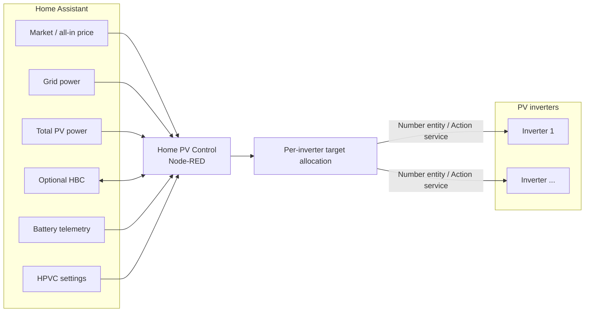

<p align="center">
  
</p>

<p align="center">
  <a href="releases/v1.5.4/release.md"></a>
  <a href="https://www.home-assistant.io/"></a>
  <a href="https://nodered.org/"></a>
  <a href="LICENSE"></a>
  <a href="https://github.com/BioPC/home-pv-control/stargazers"></a>
</p>

<p align="center">
  <a href="https://ko-fi.com/mperez"></a>
  <a href="https://paypal.me/MPerezCabrera"></a>
</p>

# Home PV Control

Home PV Control (HPVC) dynamically controls, limits and restores PV inverter output in Home Assistant through Node-RED. It is designed for dynamic electricity contracts and can run as a standalone PV controller or integrate with Home Battery Control (HBC).

- Reduce unwanted or uneconomic PV export.
- Preserve useful PV for household consumption.
- Restore inverter output automatically when conditions improve.
- Coordinate available PV with optional HBC battery charging.
- Protect against negative all-in prices with minimum-PV control and optional HBC grid charging.

> [!IMPORTANT]
> HPVC requires at least one configured inverter control path: either a writable Home Assistant `number` entity or a stable Home Assistant action/service adapter. Limits can use Watts or Percent. HPVC controls through Home Assistant integrations; it does not communicate with inverter hardware directly.

See [Inverter compatibility](docs/05-inverter-compatibility.md) and [Configuration](docs/02-configuration.md) for the four compatibility statuses, current brand/integration matrix and configuration.

<p align="center">
  
</p>

## Contents

- [Main features](#main-features)
- [Requirements](#requirements)
- [Quick install](#quick-install)
- [How HPVC works](#how-hpvc-works)
- [Architecture](#architecture)
- [Dashboard](#dashboard)
- [Home Battery Control integration](#home-battery-control-integration)
- [Shipped defaults](#shipped-defaults)
- [Safety](#safety)
- [Accuracy, Insights and reports](#accuracy-insights-and-reports)
- [Screenshots](#screenshots)
- [Upgrading](#upgrading)
- [Uninstalling](#uninstalling)
- [Documentation](#documentation)
- [Support](#support)
- [Repository structure](#repository-structure)
- [Support the project](#support-the-project)
- [Credits](#credits)
- [License](#license)
- [Disclaimer](#disclaimer)

## Main features

### ☀️ PV control
- Standalone PV export control
- Dynamic export limiting and automatic import recovery
- Multi-inverter support with per-inverter minimum and maximum limits
- Per-inverter Watt or percentage limits
- Generic Home Assistant Number entity and Action/service adapters
- Negative all-in-price minimum-PV protection
- Night Restore with PV recovery hysteresis

### 🔋 Battery integration
- Optional Home Battery Control (HBC) integration
- Charge Priority for `Charge` and `Charge PV`
- Optional HBC grid charging during negative prices
- HBC multi-battery support for 1–6 batteries
- Battery eligibility, headroom and taper-aware control

### 🧠 Reliability
- Healthy inverters continue operating when another configured inverter becomes unavailable
- Degraded-mode grid-target correction uses only currently controllable inverter capacity
- Automatic proportional rebalance when an unavailable inverter recovers
- Recovery confirmation accounts for inverter command step size
- Inverter telemetry freshness and write/readback verification
- Routine `Unconfirmed → Healthy` write confirmations are suppressed from Insights
- Automatic safety recovery can re-enable HPVC after the required inputs remain healthy for the confirmation window
- Safe shutdown, restore and bounded recovery behavior

### 📊 Visibility and diagnostics
- Today’s Insights and Power Control history
- Daily Control Accuracy with four loss factors
- On-demand HTML and TXT support reports
- Ready-to-import Home Assistant dashboard

### 🔄 Maintenance
- Smart Update from the HPVC dashboard
- Installed Home Assistant websocket dependency verification through Node-RED `/nodes`
- Transaction-safe update, rollback and recovery handling
- Manual upgrade and safe uninstall workflows

## Requirements

- Home Assistant Core **2025.12 or newer** with package support. Earlier versions may work but are outside the documented support baseline.
- A currently supported Node-RED runtime. Node-RED 4.x requires Node.js 18.2.0 or newer for the declared Home Assistant websocket 0.80.3 baseline; Node-RED 5.x requires Node.js 22 or newer. Home Assistant add-on users should use the runtime bundled by the supported Node-RED add-on rather than pinning a separate JavaScript-runtime minimum.
- One or more PV inverters with either a writable `number.*` active-power limit or a stable Home Assistant action/service that can apply an active-power limit.
- A valid grid-power sensor, market/export-price sensor, all-in-price sensor and PV-power sensor.
- ApexCharts Card for the supplied dashboard graphs.
- Home Battery Control only for optional HBC execution tracking and Charge Priority.

## Quick install

1. **Enable Home Assistant packages and install the HPVC package file.**

   Open `configuration.yaml` and make sure package loading is enabled:

   ```yaml
   homeassistant:
     packages: !include_dir_named packages
   ```

   If your `configuration.yaml` already contains a `homeassistant:` section, add the `packages:` line under that existing section instead of creating a second `homeassistant:` key.

   Copy [`home assistant/hpvc_config.yaml`](home%20assistant/hpvc_config.yaml) to:

   ```text
   /config/packages/hpvc_config.yaml
   ```

2. **Install and register the HPVC dashboard.**

   Recommended — managed dashboard with automatic Smart Update support:

   Copy [`home assistant/hpvc_dashboard.yaml`](home%20assistant/hpvc_dashboard.yaml) to the Home Assistant configuration root, in the same folder as `configuration.yaml`:

   ```text
   /config/hpvc_dashboard.yaml
   ```

   Register it in `configuration.yaml`:

   ```yaml
   lovelace:
     mode: storage
     dashboards:
       hpvc-dashboard:
         mode: yaml
         title: Home PV Control
         icon: mdi:solar-power
         show_in_sidebar: true
         filename: hpvc_dashboard.yaml
   ```

   If a `lovelace:` section already exists, merge the `hpvc-dashboard:` entry into the existing `dashboards:` section instead of adding a second `lovelace:` key.

   Alternative — custom dashboard:

   Create a dashboard/view in Home Assistant and paste the supplied dashboard YAML manually. This works, but Smart Update will not modify that custom dashboard.

3. **Check the Home Assistant configuration and restart Home Assistant once.**

   Do this only after the package file and dashboard registration are both in place.

4. **Import and deploy the Node-RED flow.**

   Import [`node-red/hpvc_flow.json`](node-red/hpvc_flow.json) into Node-RED and deploy it.

5. **Configure HPVC.**

   Open the always-visible **Settings** tab and configure the grid-power, market/export-price, all-in-price, PV-power and per-inverter control paths.

6. **Verify first startup.**

   Wait for first-install validation to complete. HPVC enables automatically once all required live inputs and control settings are valid.

See the full [installation guide](docs/01-installation.md) for dependencies and first-run verification.

## How HPVC works

HPVC evaluates live grid power, PV production, electricity prices and configured inverter limits every 10 seconds, as well as after startup and relevant setting changes.

It dynamically limits or restores PV output while respecting configured deadband, cooldown, inverter availability and optional HBC Charge Priority. Multi-inverter systems continue operating with healthy inverters if another becomes unavailable, and recovered inverters are automatically rebalanced.

See [How HPVC works](docs/03-how-it-works.md) for the complete control sequence, target calculations, inverter recovery, safety gates, HBC coordination and runtime behavior.

## Architecture


```mermaid
flowchart LR
    subgraph HA["Home Assistant"]
        PRICE["Market / all-in price"]
        GRID["Grid power"]
        PV["Total PV power"]
        HBC["Optional HBC"]
        BAT["Battery telemetry"]
        CFG["HPVC settings"]
    end

    HPVC["Home PV Control<br/>Node-RED"]

    ALLOC["Per-inverter target allocation"]

    subgraph INV["PV inverters"]
        INV1["Inverter 1"]
        INVN["Inverter ..."]
    end

    PRICE --> HPVC
    GRID --> HPVC
    PV --> HPVC
    HBC <--> HPVC
    BAT --> HPVC
    CFG --> HPVC

    HPVC --> ALLOC
    ALLOC -->|"Number entity / Action service"| INV1
    ALLOC -->|"Number entity / Action service"| INVN
```

Node-RED runs the HPVC control engine while Home Assistant provides live sensors, configuration, helpers and the dashboard. HPVC can coordinate optional HBC control and dynamically distribute the calculated PV target across multiple inverter control paths.

See [How HPVC works → Node-RED flow architecture](docs/03-how-it-works.md#node-red-flow-architecture) for the detailed control architecture, recovery behavior and runtime model.

## Dashboard

The supplied dashboard provides three main working areas:

- **Main** — current HPVC status, power flow, price context and control state.
- **Settings** — sensor selection, inverter control paths, thresholds, HBC permissions and restore options.
- **Report** — on-demand HTML/TXT diagnostics for installation checks, troubleshooting and support.

See [Installation](docs/01-installation.md) and [Configuration](docs/02-configuration.md) for setup details.

## Home Battery Control integration

HPVC can optionally coordinate PV control with Home Battery Control (HBC), including Charge Priority, negative-price charging, multi-battery eligibility, taper handling and degraded HBC operation.

See [Configuration → HBC integration](docs/02-configuration.md#hbc-integration) for setup and [How HPVC works → HBC battery charge priority](docs/03-how-it-works.md#hbc-battery-charge-priority) for runtime behavior.

## Shipped defaults

HPVC ships with conservative starting values for price control, grid thresholds, cooldown, deadband and HBC behavior. They are starting points rather than universal recommendations.

See [Configuration → Shipped defaults](docs/02-configuration.md#shipped-defaults) for the authoritative defaults table, price-sensor guidance and adjustment notes.

## Safety

HPVC validates required inputs, inverter control paths and configuration before sending writes, and uses bounded recovery, telemetry freshness checks and safe shutdown/restore behavior.

See [How HPVC works](docs/03-how-it-works.md) for the safety model and [Troubleshooting](docs/04-troubleshooting.md) for recovery cases.

## Accuracy, Insights and reports

HPVC provides Daily Control Accuracy, operational Insights, Power Control history and HTML/TXT support reports covering inverter, sensor, HBC, battery and runtime diagnostics.

See [How HPVC works → Accuracy and factor attribution](docs/03-how-it-works.md#accuracy-and-factor-attribution) and [Report generation and diagnostics](docs/03-how-it-works.md#report-generation-and-diagnostics) for details.

## Screenshots

The bundled screenshots are retained for orientation and may show an earlier HPVC version. The shipped v1.5.4 YAML and Node-RED flow are authoritative.

### Settings

<p align="center">
  
</p>

### Report

<p align="center">
  
</p>

### Node-RED flow

Reference Node-RED architecture screenshot.


## Upgrading

From v1.5.3 onward, supported Home Assistant OS/Supervised Node-RED add-on installations can update from **Settings → Maintenance → HPVC updates**.

Smart Update preserves HPVC configuration, helper values and saved data, validates the selected release, safely replaces managed HPVC assets and provides transaction, rollback and recovery protection. After a successful update, use **Quick Reload Home Assistant** when prompted.

v1.5.4 also strengthens multi-inverter degraded operation and recovery: healthy inverters continue control when another is unavailable, recovered inverters are proportionally rebalanced, and recovery confirmation accounts for inverter command step size.

For the authoritative update lifecycle, rollback/recovery behavior, trust model and manual upgrade procedure, see [Installation → Smart update from v1.5.3 onward](docs/01-installation.md#smart-update-from-v153-onward).

See the [v1.5.4 release notes](releases/v1.5.4/release.md) for the full release summary.

## Uninstalling

Use **Settings → Uninstall HPVC** for the supplied safe uninstall workflow. If you only need to rebuild the Node-RED side, use **Settings → Maintenance → Manual upgrade → Remove HPVC flows** instead.

See [Installation → Full uninstall](docs/01-installation.md#full-uninstall) for the authoritative uninstall procedure, owned-file behavior and recovery guidance.

## Documentation

- [Installation](docs/01-installation.md)
- [Configuration](docs/02-configuration.md)
- [How it works](docs/03-how-it-works.md)
- [Troubleshooting](docs/04-troubleshooting.md)
- [Inverter compatibility](docs/05-inverter-compatibility.md)
- [Documentation index](docs/README.md)
- [Changelog](CHANGELOG.md)
- [v1.5.4 release notes](releases/v1.5.4/release.md)

For Home Battery Control itself, see the [HBC documentation](https://docs.homebatterycontrol.com/).

## Support

The HTML support report is published at `/local/hpvc/support-report.html`. The dashboard keeps the **Generate report → Generating… → View report** workflow, and opening the report on the local Home Assistant network resets the tile to **Generate report** through the bundled local-only Home Assistant webhook. Remote viewing still opens the report, but the local-only reset webhook is intentionally rejected. Because `/local/` files are served without Home Assistant authentication, treat the report URL as locally accessible diagnostic output and avoid exposing it beyond networks you trust.

Before opening an issue:

1. Generate an HPVC support report.
2. Remove private entity names or data you do not want to share.
3. Include the HPVC, Home Assistant and Node-RED versions.
4. Describe the expected behavior and what actually happened.

Use [GitHub Issues](https://github.com/BioPC/home-pv-control/issues) for reproducible bugs and feature requests.

## Repository structure

```text
home assistant/
  hpvc_config.yaml      # Home Assistant package and helpers
  hpvc_dashboard.yaml   # Dashboard source; may be copied to /config/hpvc_dashboard.yaml or pasted into a HA dashboard/view

node-red/
  hpvc_flow.json        # Importable Node-RED flow with four functional tabs

examples/
  hoymiles-opendtu-2-inverters.reference.json

assets/
  banner.png
  logo.png
  screenshots/
    dashboard_main.png
    dashboard_settings.png
    hpvc_report.png
    node_red_flow.png

docs/
  01-installation.md
  02-configuration.md
  03-how-it-works.md
  04-troubleshooting.md
  05-inverter-compatibility.md
  README.md

releases/
  v1.0.0/
  ...
  v1.5.4/
```

## Support the project

Home PV Control is free and open source. If you find it useful, you can support continued development.

<p align="left">
  <a href="https://ko-fi.com/mperez"></a>
  <a href="https://paypal.me/MPerezCabrera"></a>
</p>

## Credits

Inspired by the Home Assistant and Node-RED workflow of [Home Battery Control](https://github.com/gitcodebob/marstek-venus-rs485-node-red) by gitcodebob.

## License

GPL-3.0-or-later. See [LICENSE](LICENSE).

## Disclaimer

Home PV Control modifies PV inverter power limits through Home Assistant and Node-RED integrations.

By using this software, you acknowledge that:

- You are responsible for verifying that your inverter, Home Assistant and Node-RED configuration are compatible and correctly configured.
- Incorrect configuration may reduce solar production, produce unexpected inverter behavior or fail to achieve the intended energy-management strategy.
- The software is provided “as is” without warranty of any kind.
- Always verify configuration changes safely before using them in a production energy system.
- The author is not responsible for financial loss, equipment damage, data loss, regulatory issues or other consequences resulting from use of this project.

Use this project at your own risk.
